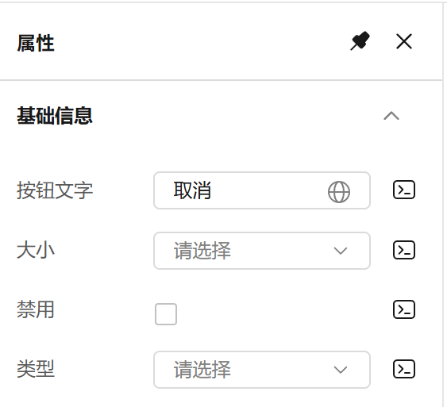
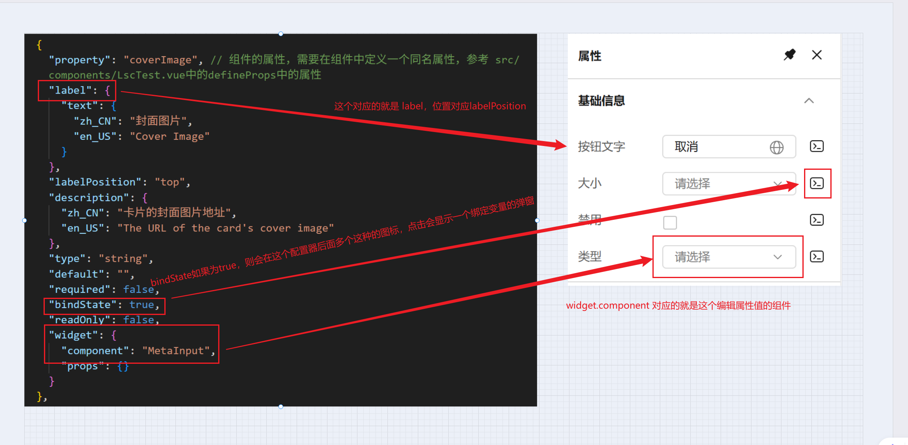

```json
{
  "data": {
    // 固定格式
    "framework": "Vue", // 固定格式，目前只支持 vue
    "materials": {
      // 物料内容
      "components": [
        // 组件，还有区块和snippet，其中区块基本用不上
        {
          "name": {
            // 组件的名称，一个对象，可以配置中英文
            "zh_CN": "卡片测试组件",
            "en_US": "Card Test Component"
          },
          "component": "LscTest", // 组件的名称
          "description": "这是一个测试组件，用于展示卡片的功能。",
          "version": "1.0.0", // 组件版本号，必要，且每次编辑时需要修改版本号
          "docUrl": "", // 文档地址，基本用不上
          "screenshot": "", // 截图，同样基本用不上
          "npm": {
            // npm 信息，必填且重要，解析如何导入自定义组件
            "package": "", // 组件的包名，如果是配置的npm包组件， 这个地方必填，用于从npm寻找到组件对应的包
            "exportName": "LscTest", // 必填，重要！！！组件导出时使用的名字，参考src/component.js中的export
            "version": "1.0.0", // 版本号，用于匹配npm包的版本，如果不是npm包，这个字段可以为空
            "destructuring": true // 重要，用于告诉TinyEngine，组件是使用 import { XXX } from 'my-componet' 这种解构模式 还是 import xxx from 'yyy' 这种模式，目前建议使用 解构模式
          },
          "group": "component", // 组件的分类，TinyEngine定义的是区别组件还是区块，建议与snippet分组中的group保持一致
          "category": "general",
          "schema": {
            // 组件的元数据
            "properties": [
              // 这个是在画布右侧的属性面板中设置的属性，会同步到组件的属性上，参考下面的properties区域的截图
              {
                "name": "0",
                "label": {
                  "zh_CN": "基础属性" // 组件分组信息，在属性面板中可以折叠的区域的标题
                },
                "content": [
                  // 组件具有的属性列表
                  {
                    "property": "coverImage", // 组件的属性，需要在组件中定义一个同名属性，参考 src/components/LscTest.vue中的defineProps中的属性
                    "label": {
                      "text": {
                        "zh_CN": "封面图片",
                        "en_US": "Cover Image"
                      }
                    },
                    "labelPosition": "top",
                    "description": {
                      "zh_CN": "卡片的封面图片地址",
                      "en_US": "The URL of the card's cover image"
                    },
                    "type": "string",
                    "default": "",
                    "required": false,
                    "bindState": true,
                    "readOnly": false,
                    "widget": {
                      "component": "MetaInput",
                      "props": {}
                    }
                  },
                  {
                    "property": "title",
                    "label": {
                      "text": {
                        "zh_CN": "卡片标题",
                        "en_US": "Card Title"
                      }
                    },
                    "labelPosition": "top",
                    "description": {
                      "zh_CN": "卡片的标题",
                      "en_US": "The title of the card"
                    },
                    "type": "string",
                    "default": "",
                    "required": false,
                    "bindState": true,
                    "readOnly": false,
                    "widget": {
                      "component": "MetaInput",
                      "props": {}
                    }
                  },
                  {
                    "property": "description",
                    "label": {
                      "text": {
                        "zh_CN": "卡片描述",
                        "en_US": "Card Description"
                      }
                    },
                    "labelPosition": "top",
                    "description": {
                      "zh_CN": "卡片的描述信息",
                      "en_US": "The description of the card"
                    },
                    "type": "string",
                    "default": "",
                    "required": false,
                    "bindState": true,
                    "readOnly": false,
                    "widget": {
                      "component": "MetaInput",
                      "props": {}
                    }
                  },
                  {
                    "property": "showButton",
                    "label": {
                      "text": {
                        "zh_CN": "是否显示按钮",
                        "en_US": "Show Button"
                      }
                    },
                    "labelPosition": "left",
                    "description": {
                      "zh_CN": "是否显示按钮",
                      "en_US": "Whether to show the button"
                    },
                    "type": "boolean",
                    "default": true,
                    "required": false,
                    "bindState": true,
                    "readOnly": false,
                    "widget": {
                      "component": "MetaSwitch",
                      "props": {}
                    }
                  },
                  {
                    "property": "btnText",
                    "label": {
                      "text": {
                        "zh_CN": "按钮文本",
                        "en_US": "Button Text"
                      }
                    },
                    "labelPosition": "left",
                    "description": {
                      "zh_CN": "按钮文本",
                      "en_US": "Text for the button"
                    },
                    "type": "string",
                    "default": "",
                    "required": false,
                    "bindState": true,
                    "readOnly": false,
                    "widget": {
                      "component": "MetaInput",
                      "props": {}
                    }
                  }
                ]
              }
            ],
            "slots": {},
            "events": {
              "onBtnClick": {
                "label": {
                  "zh_CN": "按钮点击事件",
                  "en_US": "Button Click Event"
                }
              }
            }
          }
        }
      ],
      "blocks": [],
      "snippets": [
        {
          "group": "自定义组件",
          "label": {
            "zh_CN": "自定义组件"
          },
          "children": [
            {
              "name": {
                "zh_CN": "卡片测试组件",
                "en_US": "Card Test Component"
              },
              "icon": "card",
              "screenshot": "",
              "snippetName": "LscTest",
              "schema": {}
            }
          ]
        }
      ]
    }
  }
}
```

## properties


